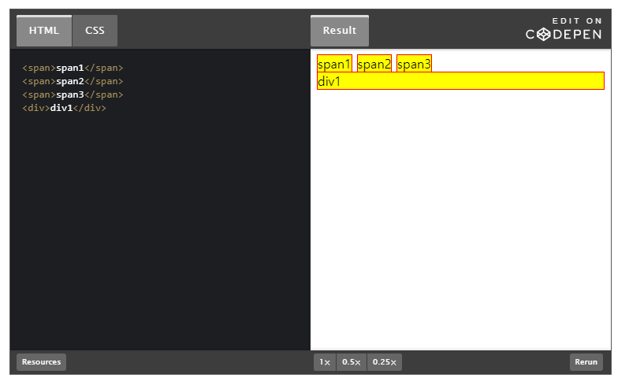
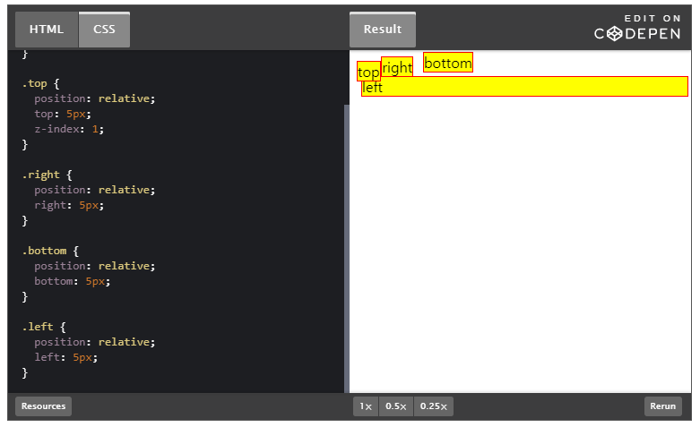
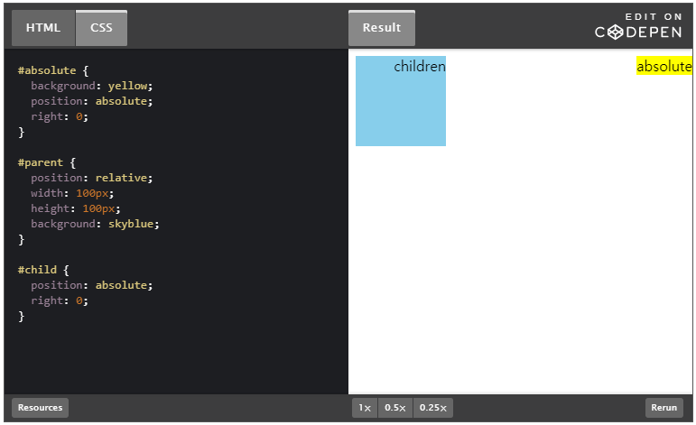
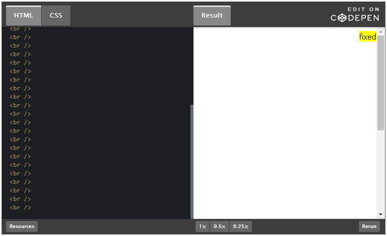

# 프론트엔드 기술면접 질문

[toc]

# :star::star::star::star::star:

## 브라우저 렌더링 원리

- 브라우저 주소창에 www.google.com 입력 
- 브라우저(클라이언트)가 서버에게 요청하고  
- DNS가 연결해줄 곳을 찾음
  - 맨처음엔 Local DNS에게 구글이라는 호스트에 대한 IP 주소를 질의하여 Local DNS에 없으면 Root DNS 정보를 받는다.
  - Root DNS : 인터넷의 도메인 네임 시스템의 루트 존. 루트 존의 레코드의 요청에 직접 응답하고 적절한 최상위 도메인에 대해 권한 있는 네임 서버 목록을 반환한다.
  - Root DNS 서버로부터 .com 도메인을 관리하는 TLD 이름 서버 정보를 전달받음
  - TLD에 구글 호스트 질의, DNS 정보 전달
  - google.com을 관리하는 서버에 구글 호스트네임에 대한 IP 주소 질의
  - Local DNS 서버에 IP 주소 응답
  - Local DNS는 www.google.com에 대한 IP 주소를 캐싱하고 IP 주소 전달
- 주소 앞에 https가 붙어있으면 https 프로토콜로 통신하고 아님 말고 
- 서버의 대부분이 index.html로 되어 있어 서버에서 이 파일을 클라이언트로 보냄 
- 브라우저는 텍스트로 이뤄진 index.html 파싱 시작 
- 한줄한줄 읽으면서 DOM 트리 만들기 
- link에서 css 요청 발생하면 요청과 응답과정을 거치고 CSS 파싱하여 CSSOM트리 구성
- CSS 파싱 끝나면 중단된 DOM 이어하기
- 완성된 DOM과 CSSOM 합쳐 Render Tree 만들기
- 중간에 script 태그 만나면 js코드를 파싱하고 실행하기 위해 파싱 중단
  - 제어권한을 자바스크립트 엔진에 넘기고 js 코드 또는 파일을 로드해서 파싱하고 실행

## 호이스팅에 대해서 설명해 보세요.

모든 선언을 가장 위로 끌어올린다.

변수의 범위가 전역 범위인지 함수 범위인지에 따라 다르게 동작될 수 있다

- 전역 범위 (Global Scope)
  - 전역 범위에서는 스크립트 최상단으로 끌어올려진다.
- 함수 범위 (Function Scope)
  - 함수 범위에서는 해당 함수 최상단으로 끌어 올려진다.

최상단으로 끌어 올려지는건 변수의 `선언`과 `할당 내용`중 `선언`뿐이다!

### 변수 호이스팅

```js
console.log(hoisting); //undefined
var hoisting = "success";
console.log(hoisting); // 'success'
```

### 함수 호이스팅

```js
a();

//함수 표현식
var a = function() {
  console.log("a is not a function"); // VM49:1 Uncaught TypeError: a is not a function
};
```

```js
console.log(sum(2,3));
console.log(name);
console.log(age);

function sum(x,y) {
  return x + y;
}

const name = 'hoo00nn';

var age = 25;
```

함수 선언문의 경우 사용이 가능하다.

### 결론

undefiled나 reference error와 같이 호이스팅의 사이드 이펙트를 피하기 위해서는 항상 변수를 스코프 최상단에서 선언하고, 선언과 함께 초기화해야 한다.

## 클로저는 무엇인가요? 원리와 왜 사용하는지 설명해 주세요

외부 변수를 기억하고 이 외부 변수에 접근할 수 있는 함수를 의미한다. 

자바스크립트의 함수는 숨김 프로퍼티인 [[Environment]]를 이용해 자신이 어디서 만들어졌는지 기억한다. 함수 본문에선 [[Environment]]를 이용해 외부 변수에 접근한다. 즉, 자바스크립트의 코드는 new Function을 제외하고 클로저이다.

### 사용하는 이유?

- 현재 상태를 기억하고 변경된 최신 상태를 유지하기 위해
- 전역 변수의 사용을 억제하기 위해
- 정보를 은닉하기 위해

## CSS에서 margin과 padding에 대해서 설명해 주세요


여백을 주는 의미에서는 같다.

Margin은 객체와 화면 사이의 여백 (외부 여백)을 말하며 Padding은 Object 내의 내부 여백을 의미한다.

### position을 어떻게 사용하는지 알려주세요.

- static (default)
- 
- relative
- 
- z-index라는 속성을 통해 누가 더 위로 올라가는지 결정 가능
- absolute
- 
- relative가 static인 상태를 기준으로 주어진 픽셀만큼 움직였다면, absolute는 static 속성을 가지고 있지 않은 부모를 기준으로 움직인다. 부모 중에 없다면 body 태그가 기준이 된다.
- fixed
- 
- 포지션이 fixed로 설정되어 특정 위치에 고정되어 있다.

## GET, POST가 어떻게 다르게 쓰는지 말씀해 주세요

GET은 정보를 요청할 때, 즉 읽을 때 주로 사용되는 메서드이다.

POST는 정보를 생성, 수정할 때, 즉 DB를 조작할 때 사용된다.

## PUT과 POST의 차이는?

POST는 생성, PUT은 수정으로 들어가나? 흠, 뭔가 애매하다.

- POST
  - 리소스의 생성을 담당한다. 요청 시마다, 새로운 리소스가 생성된다.
  - POST 메서드로 a 생성 요청을 두 번 보내면 id가 1과 2인 a가 생긴다.
- PUT
  - 리소스의 생성과 수정을 담당한다.
  - 요청 시 마다 같은 리소스를 반환한다.
- PUT은 멱등하고, POST는 멱등하지 않다.

## PATCH는?

PATCH는 수정만 담당하며 리소스의 일부분만 수정할 때 사용하고, PUT은 리소스의 모든 속성을 수정하기 위해 사용한다.

## 자바스크립트의 배열이 실제 자료구조 배열이 아닌데 그 이유는?

자바스크립트의 배열은 실제 자료구조의 배열과 다르게 HashMap으로 구현되어 있다. 링크드리스트로 구현되어 있기 때문에 값을 찾기 위해서는 탐색해나가면서 값을 찾는 불상사가 발생한다. 이를 해결하기 위해서 타이핑된배열(int8Array, Float32Array )등이  추가되고 있다.

## 이벤트 루프에 대해서 설명, 동시성 모델에 대해 설명

자바스크립트는 싱글 스레드 기반 언어이다. 함수를 실행하면 함수 호출이 스택에 순차적으로 쌓이고 스택의 맨 위에서부터 한번에 하나의 함수만 처리 가능하다.

하지만 자바스크립트는 이벤트 루프라는 것을 통해 동시성을 지원한다.

이벤트 루프는 콜 스택에서 실행 중인게 있는지 확인하고, event queue에 작업이 있는지 확인해서 콜스택이 비어있다면 이벤트 큐 내의 작업이 콜스택으로 이동되어서 실행된다.

## 프로토타입이란?

자바스크립트는 프로토타입을 기반으로 상속을 구현하여 불필요한 중복을 제거한다.

즉, 생성자 함수가 생성할 모든 인스턴스가 공통적으로 사용할 프로퍼티는 메소드를 프로토타입에 미리 구현해 놓음으로써 부모 객체의 메서드를 상속받아 사용할 수 있다. 클래스구만.


# :star::star::star::star:

## this의 용법 아는대로 설명해 주세요


## 브라우저 저장소에 대해서 차이점을 설명해 주세요 (LocalStorage, SessionStorage, Cookie)

## Restful API에 대해서 아는대로 설명해 주세요 (GET, PUT, POST, PATCH, OPTION, DELETE)

## JavaScript는 어떤 언어인가요? -> 싱글 스레드 언어

### 하지만 실제 사용시에는 멀티스레드처럼 사용하는데 어떻게 사용하나요?

### 비동기적으로 실행이 되는 것을 동기적으로 코딩하는 방법이 있나요?

## Event Loop에 대해서 알고 있으신가요?

## 이벤트 버블링에 대해서 말씀해 주세요.

### 이벤트 버블링은 기본적으로 child -> parent인데 반대로 구현하는 법은?

### 이벤트 버블링을 막기위한 방법은?

### 이벤트 버블링을 잘 활용하면 어떻게 사용할 수 있을까?

### 타입스크립트에 대해서 사용해 본 적이 있나요?

### 실행문맥에 대해서 설명해 주세요.

# :star::star::star:

## HTML이 렌더링 중에 JavaScript가 실행되면 렌더링이 멈추는데 그 이유는 무엇인가

## 현재 JavaScript 프레임워크를 사용하는 것과 그 선택을 한 이유

### 프로젝트를 진행할 때 어떤 JS 프레임워크를 선택할 것인가? 그 이유는?

### 최근 사용되는 JavaScript 프레임워크에 대해 차이점과 장단점? 언제 어떻게 사용해야 할까?

## SPA와 서버사이드 렌더링의 차이점은 무엇인가요?

## require와 import의 차이점

## SASS, SCSS를 사용해 본 적이 있나요? 기존 CSS와 비교할 때 어떤 면이 더 좋은가요?

## JavaScript 성능 최적화를 위해 어떤 것을 적용해 보았나요?

## Vue & React

### Vue와 React의 차이는?

### vue 혹은 react를 사용해보셨다면 상태관리는 어떻게 구현하셨나요?

### 라이프 사이클을 가볍게 설명해주세요

### vue에서 양방향 데이터 바인딩이 일어나는 원리에 대해서 말씀해주세요

## 무작위 데이터에 대해서 테스트는 어떻게 하시나요?

## ES6에서 Arrow 함수를 언제, 왜 쓰나요?

## var let const 차이점

## CORS를 대처하는 방법과 우회하는 방법

## MVVM 모델에 대해서 설명해 주세요.

# :star::star:

## CSS에는 Box-model 이라는 것이 있다. 이때 width의 값을 차지하는 크기는?

## 이진트리에 대해서 설명. 적용해봤냐?

## git을 사용해본적이 있나요? 사용했다면 어떻게?

## HTTP 0.9/1.0의 차이를 말씀해 주세요

## 멀티 스레드/멀티 프로세스의 차이를 아시나요

## 대표적인 정렬의 시간 복잡도와 대략적인 로직을 설명해 보세요.

### 정렬을 자바스크립트로 구현해 보세요.

# :star:

## 협업에 대해서 어떻게 생각하시나요

## 스켈레톤 UI에 대해서 적용해본 적이 있나요

## 지원자님이 시간이 있다면 Frontend 향상을 위해 어떤 노력을 할 것인가요?

## 프론트엔드 주제를 가지고 발표를 해야 한다면 바로 가능한게 있을까요?


